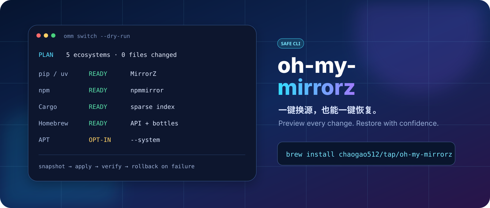
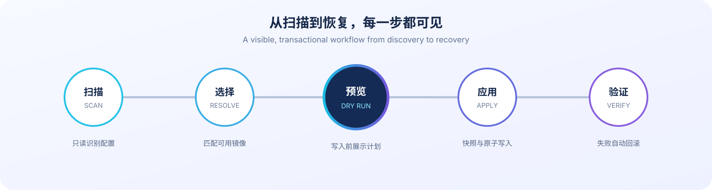

<p align="center">
  
</p>

<h1 align="center">oh-my-mirrorz</h1>

<p align="center">
  <strong>Scan once. Switch consistently. Restore every change.</strong><br>
  A safety-first mirror manager for macOS and Linux.
</p>

<p align="center">
  <a href="https://github.com/chaogao512/oh-my-mirrorz/actions/workflows/ci.yml"></a>
  <a href="https://github.com/chaogao512/oh-my-mirrorz/releases/latest"></a>
  <a href="https://github.com/chaogao512/oh-my-mirrorz/blob/main/LICENSE"></a>
  
</p>

<p align="center">
  <a href="README.md">简体中文</a> · English
</p>

> [!NOTE]
> `oh-my-mirrorz` is an independent community project. It is not an official client of MirrorZ, CERNET, or any mirror operator, and no endorsement is implied.

## Install

### Homebrew (recommended on macOS)

```bash
brew install chaogao512/tap/oh-my-mirrorz
```

`omm` is available immediately—no `.zshrc` changes required. Upgrade later with `brew upgrade oh-my-mirrorz`. The Formula lives in the dedicated [`chaogao512/homebrew-tap`](https://github.com/chaogao512/homebrew-tap) repository.

### One-line installer (macOS / Linux)

```bash
curl -fsSL https://raw.githubusercontent.com/chaogao512/oh-my-mirrorz/main/install.sh | sh
```

The installer detects the OS and architecture, downloads the matching release, and verifies SHA-256 before installation. It defaults to `~/.local/bin`. If an unrelated `omm` command already exists, it installs as `oh-my-mirrorz` instead of silently overwriting it.

You can also download amd64 or arm64 archives for macOS and Linux from [GitHub Releases](https://github.com/chaogao512/oh-my-mirrorz/releases/latest).

## Start in 30 seconds

Scan without changing any file:

```bash
omm scan
```

Preview every user-level change:

```bash
omm switch --dry-run
```

Apply the reviewed plan:

```bash
omm switch
```

Restore when needed:

```bash
omm history
omm restore
```

`restore` without an ID selects the latest restorable transaction. Use `omm restore <snapshot-id>` to choose a specific snapshot.

## Why this exists

Editing pip, npm, Cargo, Homebrew, or APT configuration is easy in isolation. The hard part is knowing which file actually wins, which fields must remain untouched, and how to recover reliably after a partial failure.

`oh-my-mirrorz` treats mirror switching as a reviewable transaction: discover the active environment, resolve a valid endpoint per ecosystem, print the planned writes, snapshot the originals, apply atomically, and verify. If any adapter fails, completed changes roll back in reverse order.

<p align="center">
  
</p>

## Supported ecosystems

| Ecosystem | Scope | Automatic choice | Safety boundary |
| --- | --- | --- | --- |
| pip / uv | User | MirrorZ / CERNET | Preserves unrelated fields; never edits project config |
| npm | User | npmmirror | Preserves scoped registries, tokens, and certificate settings |
| Cargo | User | MirrorZ / CERNET sparse index | Refuses to override project-level or custom `replace-with` rules |
| Homebrew | User `brew.env` | MirrorZ / CERNET API, bottles, and build-time PyPI | Never changes Brew/Core Git remotes |
| APT | Debian / Ubuntu system | MirrorZ APT mirrorlist | Explicit `--system` opt-in; security and third-party sources stay unchanged by default |

The current release supports macOS and Linux on amd64 and arm64. Windows, DNF, Pacman, Conda, Docker CE, Rustup, and Kubernetes are not supported yet.

## Safety is the product

- **Preview first.** `--dry-run` creates no snapshot and writes no file.
- **Snapshot first.** Every write stores the original files and transaction manifest with restrictive permissions.
- **No stale overwrite.** SHA-256 is checked again before applying; external edits made after preview stop the transaction.
- **Atomic writes.** User files use same-directory temporary files and atomic rename. System writes use narrowly constrained `sudo install` arguments.
- **Constrained targets.** Credential-free HTTPS is required by default; explicit private, loopback, and link-local endpoints are rejected.
- **Rollback on failure.** Configuration or connectivity verification failure restores completed changes in reverse order.
- **Security repositories stay timely.** Debian and Ubuntu security sources are preserved by default.

Transactions live in `$XDG_STATE_HOME/oh-my-mirrorz`, or `~/.local/state/oh-my-mirrorz` when the variable is unset.

## Mirror strategies

| Strategy | Behavior | Example |
| --- | --- | --- |
| `auto` | Uses the constrained default endpoint built into each adapter | `omm switch` |
| `fixed` | Requires one named site; fails instead of guessing unsupported URLs | `omm switch --strategy fixed --mirror tuna` |
| `prefer` | Tries one named site, then falls back to `auto` | `omm switch --prefer ustc` |

Use `omm mirrors` to inspect the built-in catalog and `omm benchmark` to probe automatic endpoints from the current network.

## Command reference

| Command | Purpose |
| --- | --- |
| `omm scan` | Read-only discovery of ecosystems and active config paths |
| `omm switch --dry-run` | Print the complete plan without writing |
| `omm switch` | Apply user-level configuration after confirmation |
| `omm switch --only pip,npm,cargo` | Limit the transaction to selected adapters |
| `omm switch --exclude homebrew` | Exclude selected adapters |
| `omm mirrors --adapter cargo` | Show built-in mirrors for one ecosystem |
| `omm benchmark` | Probe automatic strategy endpoints |
| `omm history` | List local transaction history |
| `omm restore [snapshot-id]` | Restore the latest or a selected snapshot |
| `omm doctor` | Check invalid configuration and unfinished transactions |

### Debian / Ubuntu system sources

APT is excluded by default. Preview first, then explicitly opt in to system changes:

```bash
omm scan --system
omm switch --system --dry-run
omm switch --system
```

`sudo` is requested only when a system file is actually written. Add `--include-security` only when you intentionally want to switch security repositories; it requires `--system`.

## Build from source

Go 1.26 or newer is required:

```bash
go test ./...
go build -trimpath -o omm ./cmd/omm
```

## Docs and contributing

| Topic | Entry point |
| --- | --- |
| Design, safety boundaries, and recovery model | [`docs/superpowers/specs/2026-09-03-oh-my-mirrorz-design.md`](docs/superpowers/specs/2026-09-03-oh-my-mirrorz-design.md) |
| One-line installer | [`install.sh`](install.sh) |
| Release history | [`CHANGELOG.md`](CHANGELOG.md) |
| Contributing | [`CONTRIBUTING.md`](CONTRIBUTING.md) |
| Security reports | [`SECURITY.md`](SECURITY.md) |

Issues, adapter proposals, and reproducible mirror compatibility reports are welcome. New ecosystems must document configuration precedence, credential boundaries, verification behavior, and restore semantics.

## License

[MIT License](LICENSE) © 2026 Gaochao
